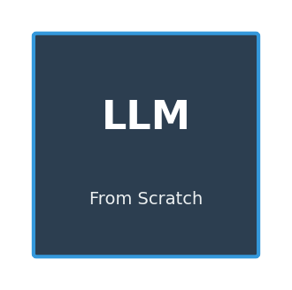

# 从零构建大语言模型：从GPT诞生到DeepSeek的技术之旅



> "This is the story of how we taught machines to understand human language — one technical breakthrough at a time."

本项目以**叙事的方式**展开大语言模型的发展历程，每一个notebook都是故事的一个篇章。从Tokenize的设计智慧讲起，一路蜿蜒至Attention的革命、GPT的Scaling、MoE的稀疏化、量化的压缩，最终抵达现代LLM的完整技术栈。

This project narrates the journey of Large Language Models from the birth of GPT through the complete technology stack of modern LLMs — each notebook is a chapter in the story.

---

## 故事线 The Narrative

### 第一章：文本的数字化 — 词分TOKENIZER的设计哲学

**为什么从Tokenizer开始？**

因为语言模型的第一道门槛是：**如何把人类的文字变成机器能认识的数字？**

字符级太低效，词级太死板。GPT-2带来的BPE（字节对编码）是一种优雅的妥协——它用统计的方法，自动找到高频的"词片段"，既不像字符那样啰嗦，也不像词那样局限。

**技术要点：**
- 字节级BPE：处理任意字符（包括中文、emoji）
- 统计合并：高频字符对优先合并
- 增量词表：从256个基础字节出发，训练到32k词表

[→ 开始阅读：01_BPE_Tokenizer.ipynb](notebooks/01_BPE_Tokenizer.ipynb)

---

### 第二章：意义的表示 — 从词嵌入到上下文表示

Token只是ID，真正的含义在**嵌入（Embedding）**中。

2013年的Word2Vec开创了词向量的先河——"king - man + woman ≈ queen"。但这解决不了一词多义。Transformer带来的**自注意力机制**，让每个词的表示变成上下文的函数。

**技术要点：**
- 可学习词嵌入 vs 固定 sinusoidal 编码
- 位置编码：让序列有序（Attention不感知位置）
- Token嵌入 + 位置嵌入 → 输入表示

[→ 深入理解：02_Embeddings_Positions.ipynb](notebooks/02_Embeddings_Positions.ipynb)

---

### 第三章：Attention革命 — Transformer架构的诞生

2017年，Google的论文"Attention is All You Need"改变了AI的发展方向。

RNN的问题：**无法并行，处理长序列时会遗忘**。

Transformer的解决方案：**用注意力机制捕捉任意位置的依赖关系**，同时支持并行训练。

**但这里有一个分支故事：**

- **NLP Transformer**：堆叠多层Self-Attention，生成下一个Token
- **Vision Transformer (ViT)**：把图像切成16×16 patches，作为"visual tokens"

两者核心思想相同，但设计细节有异：
| 特性 | NLP Transformer | Vision Transformer |
|------|----------------|-------------------|
| 输入形式 | 文本Token序列 | 图像Patch序列 |
| 位置编码 | 1D位置序列 | 2D网格位置 |
| CLS token | 可选 | 必须（用于分类） |
| 全局注意力 | 后期层捕获 | 早期层就需要 |

**为什么LLM只用NLP Transformer？**

因为语言模型的核心任务是**预测下一个Token**，这决定了它的训练目标和解码方式与图像模型不同。

[→ 理解架构：03_Sliding_Window_Attention.ipynb](notebooks/03_Sliding_Window_Attention.ipynb)

---

### 第四章：GPT的诞生 — 语言模型的Scaling Law

**GPT-1 (2018)**：微调即可完成多任务
**GPT-2 (2019)**：无需微调，prompt即可泛化
**GPT-3 (2020)**：1750亿参数，few-shot learning震惊业界

GPT-3证明了**Scaling Law**：模型越大，能力越强。但这也带来了问题——推理成本太高。

**技术要点：**
- Sparse Attention：本地窗口 + 随机注意力
- 可学习位置编码
- 巨大的前馈网络（4×embed_dim）

[→ 复现GPT-3：06_GPT3_Model.ipynb](notebooks/06_GPT3_Model.ipynb)

---

### 第五章：让上下文更长 — RoPE旋转位置编码

Transformer的原始位置编码是**加性**的，GPT-2用的是可学习位置编码。但这有一个致命问题：**无法外推到训练长度以外**。

LLaMA/DeepSeek采用的**RoPE**用旋转矩阵编码位置信息，让模型能够处理超长上下文。

**数学直觉：**
```
位置m的Q和位置n的K做内积，只依赖于 (m-n)
这意味着相对位置信息被自然编码
```

**技术要点：**
- 旋转矩阵应用到Q和K的最后d/2维度
- 无需修改注意力分数计算
- 支持长上下文外推（YaRN、NTK-aware scaling）

[→ 掌握RoPE：07_RoPE_Implementation.ipynb](notebooks/07_RoPE_Implementation.ipynb)

---

### 第六章：高效之道 — MoE专家混合

如果每个Token都要经过所有参数，计算量是巨大的。**MoE（Mixture of Experts）**的思路是：让专家分工，节省计算。

**Switch Transformer** 的创新：每次只激活1个专家（top-1 routing），相比之前MoE需要多个专家门控，大幅降低通信开销。

**DeepSeek-MoE** 更进一步：
- 细粒度专家分割
- 共享专家隔离
- 每个Token激活top-k专家

**对比稠密模型：**
- 稠密：所有参数都参与计算
- MoE：只有被选中的专家计算（稀疏激活）

[→ 理解MoE：04_MoE_Architecture.ipynb](notebooks/04_MoE_Architecture.ipynb)

---

### 第七章：让大模型变小 — 量化技术

1750亿参数的模型，FP16也要350GB显存。推理成本高得离谱。

**量化**的核心思想：用更少的bit表示权重。

**主流方法：**
| 方法 | 原理 | 精度损失 |
|------|------|----------|
| INT8 | 逐层量化，保留 outlier | 中等 |
| GPTQ | 逐渐进量化，利用Hessian信息 | 低 |
| AWQ | 激活值加权，保留关键权重 | 低 |
| INT4 | 极端压缩，但效果下降明显 | 高 |

[→ 学习量化：05_Quantization.ipynb](notebooks/05_Quantization.ipynb)

---

### 第八章：工具的力量 — Function Calling与Agent

大模型能生成文本，但无法执行动作。**Function Calling**让模型能够调用外部工具。

**工具调用流程：**
1. 模型识别需要调用的工具
2. 生成符合工具规范的JSON参数
3. 执行工具，获取结果
4. 将结果加入上下文，继续生成

**更复杂的范式 — ReAct：**
```
Thought: 我需要知道今天北京的天气
Action: call_weather(city="北京")
Observation: 天气晴朗，25°C
Thought: 根据天气信息，我可以回答用户问题了
```

**工具定义的要素：**
- name：工具名称
- description：工具用途
- parameters：参数schema（JSON Schema格式）

[→ 掌握工具调用：10_Function_Calling.ipynb](notebooks/10_Function_Calling.ipynb)

---

### 第九章：知识的扩展 — RAG检索增强生成

大模型的知识是**静态的**（训练截止日期），无法即时更新。**RAG（Retrieval-Augmented Generation）**让模型能够检索外部知识。

**RAG的核心问题：**
1. **检索什么？** — 向量数据库，用Embedding相似度
2. **如何检索？** — 密集检索（Bi-encoder）vs 稀疏检索（BM25）
3. **如何融合？** — 混合检索（RRF融合）

**评估指标：**
- Precision@K：Top-K检索的相关文档比例
- MRR：平均倒数排名
- RAGAS：答案质量评估

[→ 理解RAG：09_RAG_Retrieval-Augmented_Generation.ipynb](notebooks/09_RAG_Retrieval-Augmented_Generation.ipynb)

---

### 第十章：汇聚一切 — DeepSeek风格完整模型

DeepSeek-V4代表了现代LLM技术的集大成者：

**技术栈全景：**
| 组件 | 技术 | 作用 |
|------|------|------|
| Tokenizer | BPE | 文本→Token |
| 位置编码 | RoPE | 长上下文支持 |
| 注意力 | Sliding Window + RoPE | O(n×w)复杂度 |
| 前馈 | MoE | 稀疏激活 |
| 压缩 | INT4量化 | 减小显存 |

**计算公式：**
```
总参数量 = 8个专家 × 2048隐藏层 × 512嵌入维度
活跃参数量 = 2个专家 × 2048 × 512  (top-2激活)
稀疏度 = 75%
```

这意味着：用25%的计算量，达到了接近稠密模型的效果。

[→ 整合学习：08_DeepSeek_Integration.ipynb](notebooks/08_DeepSeek_Integration.ipynb)

---

## 项目结构 Project Structure

```
LLM_From_Scratch/
├── notebooks/                          # 故事章节
│   ├── 01_BPE_Tokenizer.ipynb         # 第一章：Tokenizer设计
│   ├── 02_Embeddings_Positions.ipynb  # 第二章：词嵌入与位置编码
│   ├── 03_Sliding_Window_Attention.ipynb  # 第三章：Attention机制变体
│   ├── 04_MoE_Architecture.ipynb      # 第六章：MoE专家混合
│   ├── 05_Quantization.ipynb          # 第七章：量化压缩
│   ├── 06_GPT3_Model.ipynb           # 第四章：GPT-3完整实现
│   ├── 07_RoPE_Implementation.ipynb  # 第五章：RoPE旋转编码
│   ├── 08_DeepSeek_Integration.ipynb # 第十章：技术集大成
│   ├── 09_RAG_Retrieval-Augmented_Generation.ipynb  # 第九章：知识增强
│   ├── 10_Function_Calling.ipynb     # 第八章：工具调用
│   └── 11_Training_and_Inference_Optimization.ipynb # 补充：微调与优化
├── images/
│   ├── logo.png
│   └── llm_evolution.png
├── README.md
└── requirements.txt
```

---

## 扩展主题 Extended Topics

以上10章覆盖了LLM核心技术。第十一章补充了训练和推理优化内容：

| 主题 | 说明 | 推荐资源 |
|------|------|----------|
| **微调方法** | SFT、RLHF、DPO、LoRA | [LLaMA Factory](https://github.com/hiyouga/LLaMA-Factory) |
| **分布式训练** | ZeRO、FSDP、Pipeline Parallelism | [DeepSpeed](https://www.deepspeed.ai/) |
| **长上下文优化** | YaRN、NTK-aware scaling、Flash Attention | 官方实现 |
| **推理优化** | Paged Attention、Speculative Decoding | [vLLM](https://vllm.ai/) |
| **多模态** | LLaVA、MiniGPT-4 | 官方仓库 |

[→ 深入学习：11_Training_and_Inference_Optimization.ipynb](notebooks/11_Training_and_Inference_Optimization.ipynb)

---

## 快速开始 Quick Start

```bash
pip install torch numpy matplotlib
jupyter notebook notebooks/01_BPE_Tokenizer.ipynb
```

---

## 技术发展时间线 Timeline

```
2013  Word2Vec        词嵌入时代开启
2017  Transformer    Attention革命诞生
2018  GPT-1          生成式预训练探索
2019  GPT-2          BPE + Zero-shot突破
2020  GPT-3          175B参数，Few-shot震惊业界
2020  Longformer     Sliding Window Attention
2021  Switch Trans.  MoE稀疏化先驱
2022  Chinchilla     caling Law再思考
2023  LLaMA           开源LLM新纪元
2023  GPT-4           多模态 + Function Calling
2023  GPTQ/AWQ       量化技术成熟
2024  DeepSeek-V4    RoPE + MoE + 量化集大成
```

---

## 参考资料 References

- **BPE/Tokenization**
  - [GPT-2 Paper](https://d4mucfpksywv.cloudfront.net/better-language-models/language-models.pdf)
  - [SentencePiece](https://github.com/google/sentencepiece)

- **Attention & Transformer**
  - [Attention is All You Need](https://arxiv.org/abs/1706.03762)
  - [ViT: Vision Transformer](https://arxiv.org/abs/2010.11929)

- **Position Encoding**
  - [RoFormer](https://arxiv.org/abs/2104.09864)
  - [Llama](https://arxiv.org/abs/2302.13971)

- **MoE**
  - [Switch Transformer](https://arxiv.org/abs/2101.03961)
  - [DeepSeek-MoE](https://arxiv.org/abs/2401.14166)

- **Quantization**
  - [GPTQ](https://arxiv.org/abs/2210.17323)
  - [AWQ](https://arxiv.org/abs/2306.00978)

- **Agent & Tool Use**
  - [OpenAI Function Calling](https://platform.openai.com/docs/guides/function-calling)
  - [ReAct](https://arxiv.org/abs/2210.03629)

---

## 贡献者 Contributors

[@Claude](https://github.com/MiniMax-AI) [@MiniMax](https://github.com/MiniMax-AI)

---

*本项目旨在以故事的方式，帮助开发者理解LLM技术的演进脉络，而非碎片化地罗列知识点。*